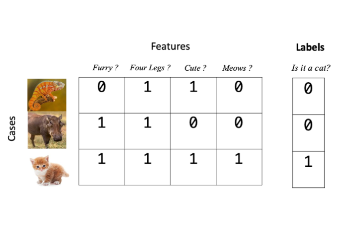

# Supervised Learning

## About this chapter

1. Questions
    * How can I find items in data that are like things I already know about?
2. Objectives
    * Understand labelled data and classification
    * Understand training and test data
    * Understand K nearest neighbours and Random Forest
3. Key Points
    * Supervised learning is classifying cases or elements based on examples that we already know
    * Good training data is key
    * Don't mix test and training data
    
In this chapter we'll take a look at supervised learning tools. It's called supervised learning because we have a  set of data that we have already classified into one or more groups and the algorithms use that as guide and try to fit some other unknown data into the groups we've specified, so the classification is supervised in the sense that there are known examples of the groups. Again the input data is usually a data matrix of some features, like measurements or gene expression values. 


## Labelled Data

For supervised learning algorithms we need to give examples of our categories. This is called labelling the data. And in most cases we can achieve this just by extending our $np$ features/cases data matrix by one column and add a label in there, usually as a number. For our animal matrix example that would look like this if we wanted to label our data as a cat or not.

```{r, echo=FALSE}

```

The object for the learning algorithm is then to guess labels for data that we don't know beforehand. So in our animal matrix example, that looks like this

```{r, echo=FALSE}
knitr::include_graphics("figs/labels2.png")
```


## Training and Testing

### The Training Phase

Most supervised learning algorithms have an initial training phase. Training is a part of the procedure where the algorithm creates a model - an internal representation of the data and the associated categories or groups - that it can later use to tell which of our categories a new observation or case belong to. Each type of supervised learner has a different approach to training. 

### The Testing Phase

Once we have a trained model we must evaluate its accuracy. If we can't tell how accurate the model is, then we can't trust it's predictions and there is not point proceeding.  We can test the model on data that _we_ know the labels of but that the model _hasn't seen before_. The testing phase is crucial and it is imperative that we don't use the same data for testing that we used for training, doing so would be like giving a student the answers before the test. The accuracy would be artificially high as they'd already seen the right answers. Once we have a good test of the model done we can use it. Ideally, we'd want the model to give high accuracy, but that can be subjective. For some applications we might need 99% or greater accuracy, in others just getting an answer better than random would do. 


## Measuring accuracy

Measuring accuracy of a model in the testing phase is less straightforward than we might first think We might assume that all we have to do is count the number of test cases that we got correct, but that is only one quarter of the story at best!.  In fact, for a binary classification (a model that knows only two groups, e.g in our animal example a model that can say whether it thinks something is or isn't a cat) there are two ways to be right and two ways to be wrong and we must calculate as many of these we can in order to get a good accuracy estimate. For a model with more than two groups or for models trying to predict a quantity rather than a group the question is more complicated and we'll look at those later. 

### Two ways to be right: True Positives and True Negatives 

The two ways to be right are to get a correct positive classification - a True Positive and a correct negative classification - a True Negative. These are easier to understand graphically. In the figure below we have a set of trained model generated answers and their true classes. 

```{r, echo=FALSE}
knitr::include_graphics("figs/tptn.png")
```

A True Positive occurs when the model classifies a case positively (is a cat) and is correct, similarly a True Negative occurs when  the model classifies a case negatively (is not a cat) and is correct.

### Two ways to be wrong: False Postive and False Negatives

The two ways to be wrong are False Positive and false negative classifications False Positives and False Negatives. A False Positive occurs when the model classifies a non-cat as a cat and a False Negative occurs when the model classifies a cat as not a cat.

```{r,echo=FALSE}
knitr::include_graphics("figs/fpfn.png")
```

### Sensitivity and Specificity

For a given set of test data for which we know the true labels, we run the model and get it's classifications. We can count up the True/False Positive/Negatives and calculate two quantities Sensitivity and Specificity. Sensitivity tells us roughly what proportion of True Positives we got, given the errors and Specificity tells how few wrong calls we made. The two measures are therefore complementary and are used together to get a picture of how well the model performs. A good model is high in both. The quantities are calculated as follows

$ Sensitivity = \frac{TP}{TP+FN}$
$ Specificity = \frac{TN}{TN+FP}$

### Other measures of accuracy

There are in fact, many other measures of accuracy in use beyond sensitivity and specificity. These include things called $F$ scores, precision and recall, FDRs and (confusingly) one actually called accuracy. It's important to know that they are all a bit different and give different measures but they all try to capture the 'rightness' or 'accuracy' of our classifiers. As we try out different tools we will see other measures.


## $k$-Nearest Neighbours

The $k$-Nearest Neighbour algorithm is a multi-class capable classification algorithm. Like the unsupervised methods this relies on distance measures between cases/elements and tries to apply a class to an unknown element by looking at the number of nearest neighbours classes. Roughly, the unknown case gets the class of the majority of the $k$ nearest neighbours. We can see an example in the figure below

```{r, echo=FALSE}

```

If we set $k$ to be 5 then Unknown case A has 3 orange squares and 2 red circles in its 5 nearest neighbours, so unknown case A would be classified as an orange square. Similarly, unknown case B has more green triangles in its $k$ nearest neighbours so it gets classified as a green triangle. Note how the known class labels are crucial in putting the unknown cases into classes. This approach only works because we have some known examples. Also note how much harder the algorithm would find the task if there were too few examples of each class. For this and many other types of supervised learning algorithm, the more training data we have, the better. 

### Training and evaluating $k$NN

Let's run through using the algorithm with the data below. The first phase is training and evaluation. There are 3 sets we will use, a training set of 55 points, which is labelled in a separate vector (`train_data` and `train_labels`), a test set of 20 points that is labelled (`test_data` and `test_labels`) and an unlabelled, unknown data set of 75 points that we wish to label using $k$ Nearest Neighbours.

```{r,echo=FALSE}
set.seed(124)
df <- iris
levels(df$Species) <- c("A","B","C")
colnames(df)<- c("measure1", "measure2","measure3", "measure4", "group")
muddled <- sample(nrow(df), replace = FALSE)

unknown_data <- df[muddled[1:75],]
train_data <- df[muddled[76:130],]

train_labels <- train_data$group
train_data$group <- NULL

test_data <- df[muddled[131:150],]
test_labels <- test_data$group
test_data$group <- NULL

unknown_data$group <- NULL

```
```{r}
dplyr::glimpse(train_data)
train_labels
dplyr::glimpse(test_data)
test_labels
dplyr::glimpse(unknown_data)
```

The first step is to train and test a model. As we are going to go through the process twice (one evaluating, one with unknown data), we must remember to control the random element of the algorithm. `set.seed()` with a consistent argument (`123`) puts the random number generator back to the same place each time allowing reproducibility. 

The `knn()` function is in the `class` package so we load that and pass it the `train_data` to learn from and the known `test_data` to predict groups on. The `cl` parameter gets the vector of `train_labels`. Finally the $k$ nearest neighbours is passed as `k`, here `9`. 

```{r}
set.seed(123)
library(class)
test_set_predictions <- knn(train_data, test=test_data, cl = train_labels, k=9)
test_set_predictions
```

As we can see, the predictions are returned as vector whose elements correspond to the rows of `test_data`. We can check the accuracy of the predictions by comparing the predictions with the known labels. The `caret` package function `confusionMatrix()` returns an object with lots of useful information.

```{r, message=FALSE}
library(caret)
confusionMatrix(test_set_predictions, test_labels)
```

At the top of the output, the confusion matrix shows how 'mixed' up the model got. Read it down the columns, so that for the 7 real group `A` the algorithm predicted 7 `A`, 0 `B` and 0 `C`; for the 6 real group `B` the algorithm predicted 0 `A`, 6 `B` and 0 `C` and for the 7 real group `C` the predictions were 0 `A`, 1 `B` and 6 `C`, so a `C` was misclassified as a `B`. This error rate and pattern is reflected in the overall accuracy, stated as 95 % and the more useful per group Sensitivity and Specificity, the lower Specificity for group `B` is due to the `C` miscalled as a `B` (so a false positive `B`). The same error causes the lower Sensitivity for group `C`.

### Using a trained model

Now that we have evaluated the model and know how accurate it is - and that it is accurate enough to be useful, we can run on our unknown data. This is virtually identical to before, replacing the `test_data` with the `unknown_data`. We must remember to reset the random number generator again, and we can go ahead and add the predictions straight to the data frame if we wish. We now have predicted groups for the unknown data and an estimate of the accuracy of our predictions.

```{r}
set.seed(123)
unknown_predictions <- knn(train_data, test=unknown_data, cl = train_labels, k=9)
unknown_data$predicted_group <- unknown_predictions
dplyr::glimpse(unknown_data)
```

## Random Forest

Random Forest is another supervised learning algorithm that is based on ensembles of decision trees. A decision tree is a model that resembles a question flowchart that has a 'question' at each branch point and continues until enough have been 'asked' to differentiate the item in hand. Here is one potential decision tree for the animal classification we've been using. 

```{r, echo=FALSE}
knitr::include_graphics("figs/dt.png")
```

In a Random Forest classifier trees are made using the training data and the ones that are best at classifying the data are retained. There are a whole set of possible good trees so the ensemble of trees is used, hence Random Forest. The many trees make up one model that are used with unseen data.

### Building a Random Forest Model

We use the `randomForest` package to do this, and we will use the training and test data as we did with $k$ nearest neighbours above, for random forest, the labels are specified in the data, so we don't have a separate label vector and must now add them on to the training and test data. Let's do that first

```{r}
train_data$group <- train_labels
dplyr::glimpse(train_data)

```

We can now build the model with the `randomForest()` function. The setup uses R's formula based syntax, so is very similar to that we used for linear models. The `group` is to be predicted based on `.` which means all other columns in the data `train_data`. The `model` variable holds the trained model 

```{r,message=FALSE}
library(randomForest)
model <- randomForest(group ~ ., data = train_data, mtry=2)
```

### Testing a Random Forest model

With the model built we can use the generic `predict()` function to get the model to predict groups for the unlabelled `test_data` then compare it to the real groups with `confusionMatrix()`. Setting the value of `type` to `class` tells the `predict()` we want group classifications

```{r}
test_set_predictions <- predict(model, test_data, type="class")
confusionMatrix(test_set_predictions, test_labels)
```

The model is again, convincing and highly accurate so we can repeat use `predict()` with `model` to get predictions for `unknown_data`, and again add it to the data

```{r}
unknown_predictions <- predict(model, unknown_data, type="class")
unknown_data$predicted_group <- unknown_predictions
dplyr::glimpse(unknown_data)
```


### Random Forest with categorical predictors

In our $k$NN example and the previous Random Forest predictor, the input data features were solely numeric. Random Forest can handle a mixture of numeric and character or categorical based features allowing us to make classifications on more than numbers. The process is similar, so let's get some appropriate data and do that

```{r,echo=FALSE}
unknown_data_mixed <- unknown_data
unknown_data_mixed$colour <- factor(ifelse(unknown_data$predicted_group == "A", "Green", ifelse(unknown_data$predicted_group == "B", "Blue", "White")), levels=c("Blue","Green","White"))
unknown_data_mixed$group <- unknown_data_mixed$predicted_group
unknown_data_mixed$predicted_group <- NULL

test_labels_mixed <- factor(ifelse(test_labels == "A", "Green", ifelse(test_labels == "B", "Blue", "White")), levels=c("Blue","Green","White"))

train_data_mixed <- train_data
train_data_mixed$colour <- factor(ifelse(train_data$group == "A", "Green", ifelse(train_data$group == "B", "Blue", "White")),levels=c("Blue","Green","White"))

test_data_mixed <- test_data
test_data_mixed$group <- test_labels
test_data_mixed$colour <- factor(ifelse(test_labels == "A", "Green", ifelse(test_labels == "B" , "Blue", "White")),levels=c("Blue","Green","White"))
```

```{r}
dplyr::glimpse(train_data_mixed)
dplyr::glimpse(test_data_mixed)
dplyr::glimpse(unknown_data_mixed)

```

We can see that there is a new categorical feature called `colour` in our train and test data, but not in our unknown data, so let's try to predict the colour this time.

```{r, eval=TRUE}
model2 <- randomForest(colour ~ ., data = train_data_mixed, mtry=2)

test_set_mixed_predictions <- predict(model2, test_data_mixed, type="class")
confusionMatrix(test_set_mixed_predictions, test_labels_mixed)

```

So we have created a model that is capable of perfectly predicting the value of the categoric value colour from a mixture of numeric and categoric features. Why is the model so accurate? It's a bit of a fix! This sample data has a direct mapping between the `group` and the `colour`: `A` is always `Green`, `B` is always `Blue` and `C` is always `White` so it is easy to predict colour if you have `group`. The data aren't typical in this sense but it does highlight the procedure.


### Random Forest Regression

It is also possible to perform prediction of numeric values and not just classes with Random Forest. We simply set up the model with a numeric value as the predicted value in the formula as follows

```{r}
model3 <- randomForest(measure1 ~ ., data = train_data_mixed, mtry=2)
```

Now when we use `predict()` and omit the `type` argument, we get a set of numbers, not classes back

```{r}
test_set_mixed_predictions_numeric <- predict(model3, test_data_mixed)
test_set_mixed_predictions_numeric
```

#### Evaluating numeric predictions

Previously we've evaluated predictions from our models for classes, counting True Positives etc, but we can't do that here because we have no classes. Instead we can calculate how far away from the real value the predictions are on average. That's a simple sum to do in R

```{r}
mean( (test_data_mixed$measure1 - test_set_mixed_predictions_numeric) ^ 2)
```

The quantity is called the Mean Squared Error or MSE. The lower the better, though the actual size is dependent on context. The context here is the descriptive statistics of the known values for the test data, which we can get with `summary()`

```{r}
summary(test_data_mixed$measure1)
```

These values range between 4.6 and 7.7, with 50% of them lying between 5.1 and 6.4. With that in mind it seems like an MSE of 0.17 is a pretty good result and we can conclude to predict accurately the values of `measure1` from our Random Forest Regression model.

```{block2, type="roundup"}
  * Supervised Learning uses labelled data to make predictions on unseen data
  * Random Forest can predict classes and numeric values (perform regression)
  * It is imperative to evaluate the predictive model on a set of known cases
```
